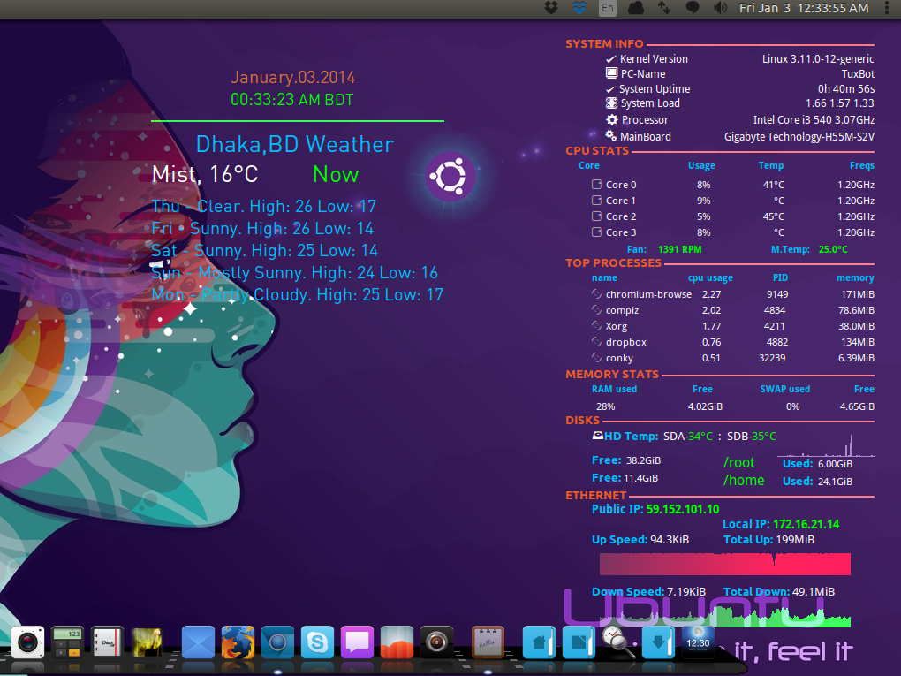

conky-theme-seamod-mix
======================

A conky theme that modify and customize from original conky-seamod theme.

    i have optimized it for 1366x768 resolution.you can edit it.
Installation:
============

 Package Dependencies
 
     sudo apt-get install lm-sensors,hd-temp,curl,conky-all,dmidecode

After installing above packages you need to change permission of following packages

    sudo chmod u+s /usr/sbin/hddtemp
    sudo chmod u+s /usr/sbin/dmidecode

*other wise hdd tempeture & main board info + tempeture won't work
 
Now for pretty looks we need to install 2 fonts STYLBCC.ttf and Poky.ttf. if don't know how to install it,then follow this link.<a href='http://www.wikihow.com/Install-TrueType-Fonts-on-Ubuntu' >Here</a>

Now go to http://weather.yahoo.com and search you city
you will get a zip code of your city like '1915035' into urls.
Now copy the zip code and open 'weather' file from downloads.
search the line 'http://xml.weather.yahoo.com/forecastrss?w=1915035&u=c'
replace code numbers with yours & save the file.

Then open conky-startup.sh file and replace below line with ur conky files location

cd "/home/penguin/mybin/conky" 

save the file.now add the 'xxx.sh' to start up application.

Enjoy :)

more details for installation <a href='http://hrshadhin.wordpress.com/2014/01/03/install-conky-conky-theme-seamod-mix-on-linux/' >Here</a>

Screenshot:
==========

